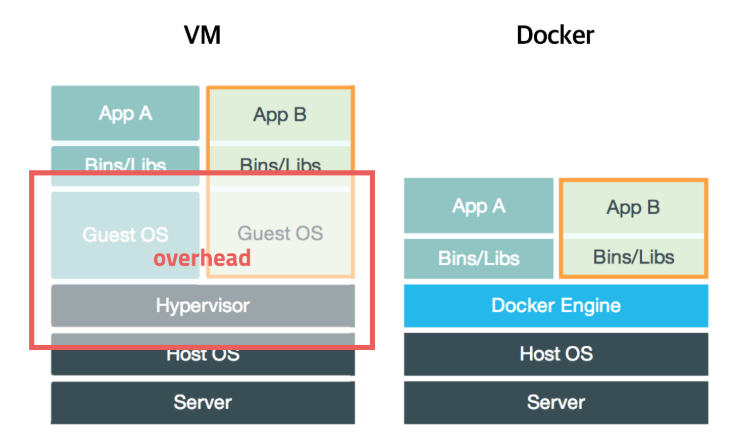
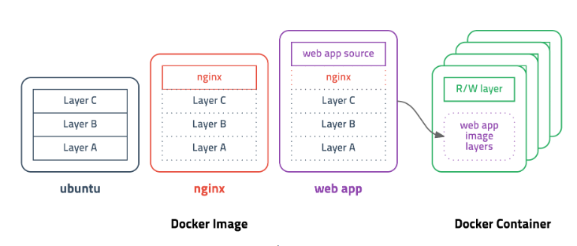
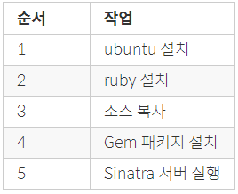
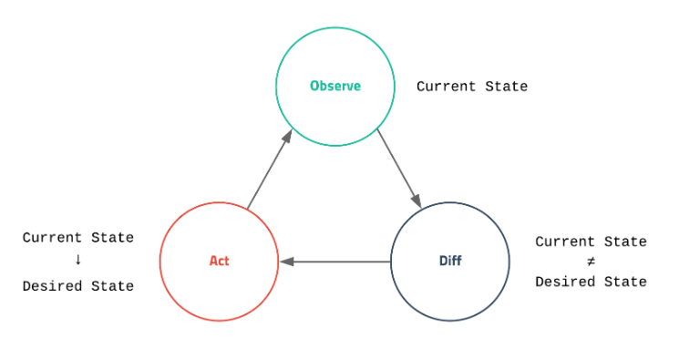
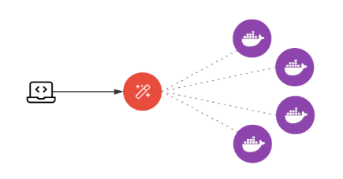

# Docker

### docker란

컨테이너 기반의 가상화 플랫폼이다.

다양한 프로그램과 실행환경, configuration들을 추상화하여 프로그램의 배포, 관리를 단순화한다.

db서버, 메시지 큐, 백엔드 프로그램 등 어떤 프로그램도 컨테이너로 추상화 할 수 있고 PC, 클라우드 환경 어디서든 실행가능하다.


##### 컨테이너?

컨테이너는 가상화 기술을 통해 독립된 공간에서 프로세스가 동작하게하는 기술이다.

기존의 VM은 OS를 가상화한다.  아무것도 없는 상태에서 새로운 os를 구동시켜야 하므로 운영체제를 위한 라이브러리, 커널 등을 이미지로 만들어야 하기 때문에 이미지의 크기가 커지게 된다. 

반면 컨테이너 기반은 하드웨어를 가상화하는 것이 아니라 실행환경을 분리하기 때문에 오버헤드가 하이퍼바이저 기반에 비해 매우 적다. CPU, 메모리도 프로세스가 필요한 만큼만 사용하여 성능적으로 손실이 거의 없다.



##### 이미지?

이미지는 **컨테이너 실행에 필요한 파일과 설정값등을 포함하고 있는 것**으로 상태값을 가지지 않고 변하지 않습니다(Immutable).  컨테이너는 이미지를 실행한 상태라고 볼 수 있고 추가되거나 변하는 값은 컨테이너에 저장된다. 

```
ubuntu이미지는 ubuntu를 실행하기 위한 모든 파일을 가지고 있고 MySQL이미지는 debian을 기반으로 MySQL을 실행하는데 필요한 파일과 실행 명령어, 포트 정보등을 가지고 있다. 좀 더 복잡한 예로 Gitlab 이미지는 centos를 기반으로 ruby, go, database, redis, gitlab source, nginx등을 가지고 있다.
```

의존성 파일을 컴파일하고 필요한 패키지를 따로 설치할 필요가 없다. 

도커 이미지는 Docker hub에 등록하거나 Docker Registry저장소를 직접 만들어 관리할 수 있다. 누구나 쉽게 이미지를 만들고 배포할 수 있다.

도커의 이미지 레이어 저장 방식




##### docker-compose?

컨테이너 조합이 많아지고 여러가지 설정이 추가되면 명령어가 금방 복잡해진다.  도커는 복잡한 설정을 쉽게 관리하기 위해 [YAML](https://en.wikipedia.org/wiki/YAML)방식의 설정파일을 이용한 [Docker Compose](https://docs.docker.com/compose/)라는 툴을 제공합니다. 

docker-compose.yml파일 예시

```
version: '2.2'
services:
  elasticsearch:
    image: elasticsearch:6.5.4
    container_name: elasticsearch
    environment:
      - cluster.name=docker-cluster
      - node.name=master-node1
      - bootstrap.memory_lock=true
      - "ES_JAVA_OPTS=-Xms512m -Xmx512m"
    ulimits:
      memlock:
        soft: -1
        hard: -1
    volumes:
      - esdata1:/usr/share/elasticsearch/data
    ports:
      - 9200:9200
      - 9300:9300
    stdin_open: true
    tty: true
    networks:
      - esnet
  elasticsearch2:
    image: elasticsearch:6.5.4
    container_name: elasticsearch2
    environment:
      - cluster.name=docker-cluster
      - node.name=data-node1
      - bootstrap.memory_lock=true
      - "ES_JAVA_OPTS=-Xms512m -Xmx512m"
      - "discovery.zen.ping.unicast.hosts=elasticsearch"
    ulimits:
      memlock:
        soft: -1
        hard: -1
    volumes:
      - esdata2:/usr/share/elasticsearch/data
    networks:
      - esnet
    ports:
      - 9301:9300
    stdin_open: true
    tty: true
    depends_on:
      - elasticsearch
  elasticsearch3:
    image: elasticsearch:6.5.4
    container_name: elasticsearch3
    environment:
      - cluster.name=docker-cluster
      - node.name=data-node2
      - bootstrap.memory_lock=true
      - "ES_JAVA_OPTS=-Xms512m -Xmx512m"
      - "discovery.zen.ping.unicast.hosts=elasticsearch"
    ulimits:
      memlock:
        soft: -1
        hard: -1
    volumes:
      - esdata3:/usr/share/elasticsearch/data
    networks:
      - esnet
    ports:
      - 9302:9300
    stdin_open: true
    tty: true
    depends_on:
      - elasticsearch

  kibana:
    container_name: kibana
    image: kibana:6.5.4
    ports:
      - 5601:5601
    networks:
      - esnet
    depends_on:
      - elasticsearch
      - elasticsearch2
      - elasticsearch3

volumes:
  esdata1:
    driver: local
  esdata2:
    driver: local
  esdata3:
    driver: local

networks:
  esnet:
```


### Docker를 왜 사용할까?

1. 가볍고 간단한 어플리케이션 배포

Dockerfile 예시)




```
# 1. ubuntu 설치 (패키지 업데이트 + 만든사람 표시)
FROM       ubuntu:16.04
MAINTAINER subicura@subicura.com
RUN        apt-get -y update

# 2. ruby 설치
RUN apt-get -y install ruby
RUN gem install bundler

# 3. 소스 복사
COPY . /usr/src/app

# 4. Gem 패키지 설치 (실행 디렉토리 설정)
WORKDIR /usr/src/app
RUN     bundle install

# 5. Sinatra 서버 실행 (Listen 포트 정의)
EXPOSE 4567
CMD    bundle exec ruby app.rb -o 0.0.0.0
```

도커 파일 = 서버 운영 기록
도커 이미지 = 도커 파일 + 실행 시점
도커 컨테이너 = 도커 이미지 + 환경 변수


2. 환경에 구애받지 않는 편리함

예시) ubuntu에서 gitlab설치

```
sudo apt-get update
sudo apt-get install -y curl openssh-server ca-certificates
sudo apt-get install -y postfix
curl https://packages.gitlab.com/install/repositories/gitlab/gitlab-ee/script.deb.sh | sudo bash
sudo EXTERNAL_URL="http://gitlab.example.com" apt-get install gitlab-ee
```

예시) centOS에서 gitlab설치

```
sudo yum install -y curl policycoreutils-python openssh-server
sudo systemctl enable sshd
sudo systemctl start sshd
sudo firewall-cmd --permanent --add-service=http
sudo systemctl reload firewalld
sudo yum install postfix
sudo systemctl enable postfix
sudo systemctl start postfix
curl https://packages.gitlab.com/install/repositories/gitlab/gitlab-ee/script.rpm.sh | sudo bash
sudo EXTERNAL_URL="http://gitlab.example.com" yum install -y gitlab-ee
```

도커 사용)

```
$ docker run --detach \
    --hostname gitlab.example.com \
    --publish 443:443 --publish 80:80 --publish 22:22 \
    --name gitlab \
    --restart always \
    --volume /srv/gitlab/config:/etc/gitlab \
    --volume /srv/gitlab/logs:/var/log/gitlab \
    --volume /srv/gitlab/data:/var/opt/gitlab \
    gitlab/gitlab-ce:latest
```


### kubernetes

쿠버네티스는 컨테이너를 쉽고 빠르게 배포/확장하고 관리를 자동화해주는 오픈소스 플랫폼이다. 단순한 컨테이너 플랫폼이 아닌 마이크로서비스, 클라우드 플랫폼을 지향하고 컨테이너로 이루어진 것들을 손쉽게 담고 관리할 수 있는 그릇 역할을 한다. 서버리스, CI/CD, 머신러닝 등 다양한 기능이 쿠버네티스 플랫폼 위에서 동작한다.

* Desired state



명령 : nginx 컨테이너를 실행해줘. 그리고 80 포트로 오픈해줘. ```$ docker run```

선언 : 80 포트를 오픈한 nginx 컨테이너를 1개 유지해줘. ```$ kubectl create```


* 쿠버네티스 아키텍처

  

  


