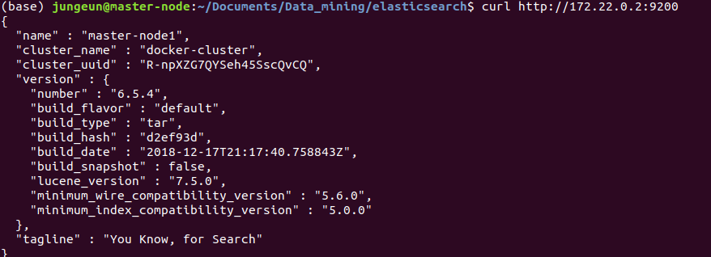

# Elasticsearch docker image를 이용해서 

# multi node 클러스터링하기

두번째 시도에 성공하였다. 처음엔 그냥 컨테이너를 실행하고 exec로 컨테이너의 yaml파일을 수정해서 해보려고 했지만 실패했다. 컨테이너간의 설정을 해야할 경우엔 docker-compose를 이용하는 것이 편리하기 때문에 두번째 시도에서는  docker-compose를 이용해 마스터노드1개, 데이터 노드 2개를 클러스터링하는 작업을 해보았다. (시도1은 건너뛰어도 된다.)


### 시도1)

```
$ sudo docker pull elasticsearch:6.5.4

$ sudo docker run --name es1 elasticsearch:6.5.4

$ sudo docker run --name es2 elasticsearch:6.5.4
```


각각 컨테이너 접속해서 config/elasticsearch.yml파일 수정

```
$ sudo docker exec -it es1 /bin/bash

$ sudo docker exec -it es2 /bin/bash
```


config/elasticsearch.yml

```cluster.name: "docker-cluster"
cluster.name: "docker-cluster"
#cluster.initial_master_nodes: "node1"
network.host: 0.0.0.0
node.name: "node1"
node.master: true
#bootstrap.mlockall: true
#transport.tcp.port: 9201
#discovery.zen.ping.unicast.hosts:["172.17.0.3:9202"]
#index.number_of_shards: 5
#index.number_of_replicas: 2
#discovery.zen.ping.timeout: 10s

#minimum_master_nodes need to be explicitly set when bound on a public IP
#set to 1 to allow single node clusters
#Details: https://github.com/elastic/elasticsearch/pull/17288
#discovery.zen.minimum_master_nodes: 1
```

```
cluster.name: "docker-cluster"
#cluster.initial_master_nodes: "node1"
network.host: 0.0.0.0
node.name: "node2"
node.master: false
bootstrap.mlockall: true
transport.tcp.port: 9202
discovery.zen.ping.unicast.hosts:["172.17.0.2:9201"]
index.number_of_shards: 5
index.number_of_replicas: 2
#discovery.zen.ping.timeout: 10s

#minimum_master_nodes need to be explicitly set when bound on a public IP
#set to 1 to allow single node clusters
#Details: https://github.com/elastic/elasticsearch/pull/17288
#discovery.zen.minimum_master_nodes: 1
```


컨테이너 로그보기

$ sudo docker logs es1


컨테이너 정보

$ sudo docker inspect es1


elasticsearch.yml파일을 수정하고 컨테이너를 재시작 하면 오류가 계속 나서 config파일 권한설정도 바꿔보고 yml파일도 버전에 맞게 바꿔보았지만 다양한 오류들이 계속 생겨서 docker-compose를 쓰게 되었다.


### 시도2)

```
$ sudo apt-get install docker-compose
```


우선 docker-compose를 설치하고 docker-compose.yml파일을 작성한다. 다음과 같이 작성한다.

```
version: '2.2'
services:
# elasticsearch는 master-node
  elasticsearch:
    image: elasticsearch:6.5.4
    container_name: elasticsearch
    environment:
      - cluster.name=docker-cluster			# 클러스터명이 같아야 클러스터링 된다.
      - node.name=master-node1				# 노드 명은 컨테이너별로 다르게 설정한다.
      - bootstrap.memory_lock=true			# 메모리 스왑을 막기 위해 설정한다.
      - "ES_JAVA_OPTS=-Xms512m -Xmx512m"	# JVM Heap메모리 설정이다.
    ulimits:
      memlock:
        soft: -1
        hard: -1
    volumes:
      - esdata1:/usr/share/elasticsearch/data
    ports:
      - 9200:9200	# Kibana에서 본 노드를 호출하기 때문에 외부 9200포트는 master-node에 연결한다.
      - 9300:9300
    stdin_open: true	# 컨테이너에 bash로 붙고 싶을경우 두 옵션을 추가해주면 된다.
    tty: true
    networks:
      - esnet
      
# elasticsearch2,3은 data-node
  elasticsearch2:
    image: elasticsearch:6.5.4
    container_name: elasticsearch2
    environment:
      - cluster.name=docker-cluster			# 클러스터 명은 같아야한다.
      - node.name=data-node1
      - bootstrap.memory_lock=true
      - "ES_JAVA_OPTS=-Xms512m -Xmx512m"
      - "discovery.zen.ping.unicast.hosts=elasticsearch"
    ulimits:
      memlock:
        soft: -1
        hard: -1
    volumes:
      - esdata2:/usr/share/elasticsearch/data
    networks:
      - esnet
    ports:
      - 9301:9300							# 외부 연결포트가 node별로 달라야함
    stdin_open: true
    tty: true
    depends_on:
      - elasticsearch						# 각 서비스를 순차적으로 실행하기 위해 설정한다.(선택)
      
  elasticsearch3:
    image: elasticsearch:6.5.4
    container_name: elasticsearch3
    environment:
      - cluster.name=docker-cluster
      - node.name=data-node2
      - bootstrap.memory_lock=true
      - "ES_JAVA_OPTS=-Xms512m -Xmx512m"
      - "discovery.zen.ping.unicast.hosts=elasticsearch"
    ulimits:
      memlock:
        soft: -1
        hard: -1
    volumes:
      - esdata3:/usr/share/elasticsearch/data
    networks:
      - esnet
    ports:
      - 9302:9300
    stdin_open: true
    tty: true
    depends_on:
      - elasticsearch

# Kibana 설정
  kibana:
    container_name: kibana
    image: kibana:6.5.4
    ports:
      - 5601:5601
    networks:
      - esnet
    depends_on:
      - elasticsearch
      - elasticsearch2
      - elasticsearch3

volumes:
  esdata1:
    driver: local
  esdata2:
    driver: local
  esdata3:
    driver: local

networks:
  esnet:
```


docker-compose.yml파일을 다 작성하였으면 그 파일이 있는 위치에서 다음 명령어를 실행하여 컨테이너를 시작해보자.

d옵션은 데몬으로 실행한다는 의미이다.

```
$ sudo docker-compose up -d
$ sudo docker inspect elasticsearch
```

두번째 명령어를 실행해서 컨테이너들에 대한 정보를 얻어 컨테이너 ip를 알아본다. 컨테이너 ip는 NetworkSettings의 Networks의 IPAddress를 보면 된다.


나의 master-node의 ip주소는 172.22.0.2이므로 이 주소로 get요청을 보내보면 다음과 같은 응답을 받게 된다.



클러스터 정보도 얻을 수 있다.


3개의 노드가 잘 클러스터링 된 것을 확인 할 수 있다. 다른 노드들에서도 정상적인 응답이 오는지 확인해본다. 

kibana의 ip address:5601로 접속해보면 다음과 같이 노드 3개가 잘 클러스터링 된 것을 확인할 수 있다.

